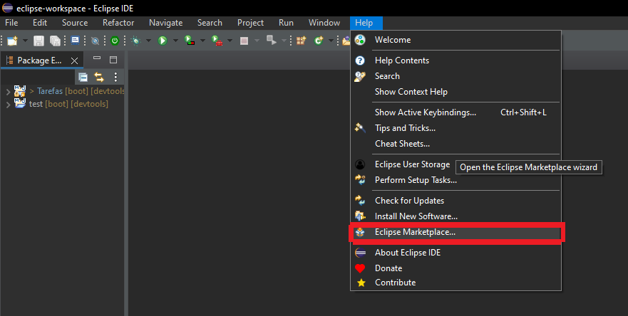
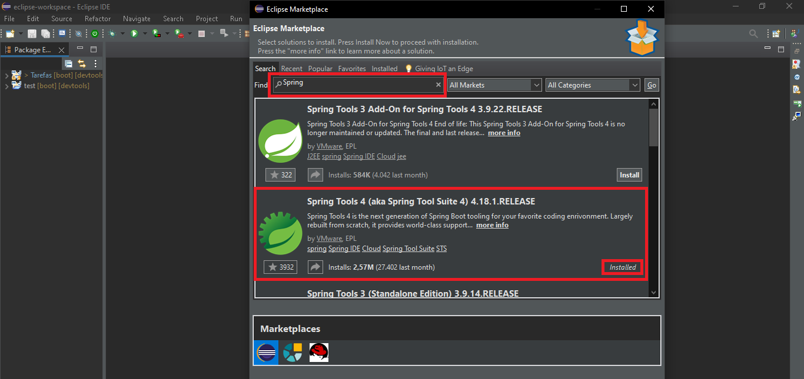
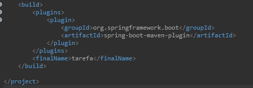
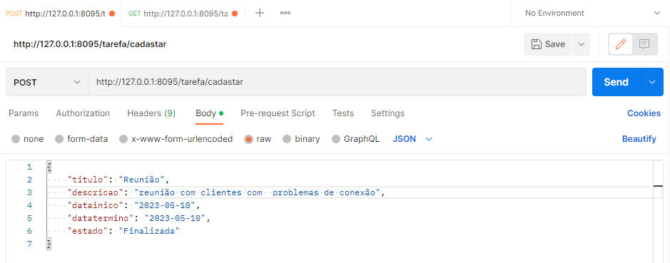
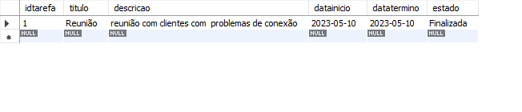
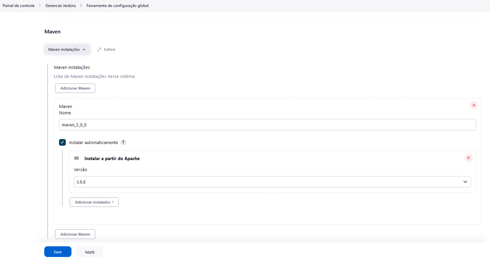
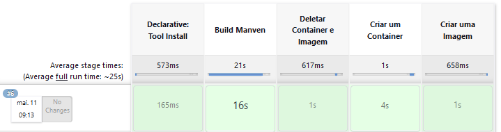

# Projeto Jenkins
## Sumário abaixo:
**É apresentado todo conteúdo que será apresentado desenvolvido**
>Nesse repositório tem como objetivo demonstrar o que foi aprendido em sala de aula sobre Springboot e a automatização de projeto com Jenkins através de um repositório do GitHub. Para isso, usou-se a linguagem Java e o banco de dados MySQL.

# Sumário:
## Conteúdo 
+ Ferramentas
    + Fedora
    + Docker
    + Jenkins 
    + MySQL Workbench
    + Eclipse
    + Springboot
    + Postman
    + Github    
+ Configurando Fedora 
    + Instalção do Java-17 e configurando a variável de ambiente
    + Instalação do Maven e configurando a variável de ambiente
    + Instalação do Jenkins
+ Mysql
    +  Criação do banco de dados
+ Eclipse
    + Instalando o Spring-Boot
    + Criando o projeto Spring
        + Criando a camanda Domain
        + Criando a camanda Repository
        + Criando a camanda Controller
        + Configurando application.properties 
        + Criando o Dockerfile e configurando porm.xml 
+ Postman
    + Testando o projeto
+ Github
    + Subindo o projeto
+ Jenkins 
    + Configurando o Jenkins
    + Criando uma nova tarefa
---
# Ferramentas
## • Fedora
> Fedora é um sistema operacional ou sistema operativo Linux. O sistema operacional Fedora Linux é software livre e de código aberto, e os programas disponíveis dentro de seu repositório de programas também são programas livres que aderem a uma licença livre.

<br>
<br>
<div align="center">
    <a href="https://fedoraproject.org/server/download/">
        
    </a>
</div >
<br>

--- 

## • Docker
> Docker é uma plataforma de software que permite criar, gerenciar e executar aplicativos em contêineres. Um contêiner é uma unidade de software que empacota código e suas dependências, permitindo que ele seja executado de maneira consistente e portátil em diferentes ambientes, como sistemas operacionais e nuvens.

<br>
<br>
<div align="center">
    <a href="https://github.com/Isack2022/Estudo-Dokcer">
        
    </a>
</div >
<br>

--- 

## • Jenkins
>Jenkins é uma ferramenta de automação de código aberto amplamente utilizada para a implementação contínua (CI) e a entrega contínua (CD) de software. Jenkins é automatizar o processo de construção, teste e implantação de software. Ele permite que os desenvolvedores integrem seu código-fonte em um repositório compartilhado (como o Git) e configurem tarefas automatizadas que são executadas em resposta a alterações no código.

<br>
<br>
<div align="center">
    <a href="https://www.jenkins.io/download/">
        
    </a>
</div >
<br>

---

## • Mysql Workbench 
>O MySQL Workbench é uma ferramenta visual de modelagem de dados, desenvolvimento e administração de banco de dados MySQL. Ela fornece uma interface gráfica para facilitar a criação, gerenciamento e manutenção de bancos de dados MySQL.

<br>
<br>
<div align="center">
    <a href="https://dev.mysql.com/downloads/workbench/">
        
    </a>
</div >
<br>

---

## • Eclipse
> O Eclipse é um ambiente de desenvolvimento integrado IDE de código aberto amplamente utilizado para a criação de software. Ele fornece um conjunto de ferramentas e recursos para facilitar o desenvolvimento de aplicativos em várias linguagens de programação.

<br>
<br>
<div align="center">
    <a href="https://www.eclipse.org/downloads/packages/release/2023-03/r/eclipse-ide-java-developers">
        
    </a>
</div >
<br>

--- 

## • Spring-Boot
> O Spring Boot é um framework de desenvolvimento de aplicativos Java que visa simplificar a criação e configuração de aplicativos baseados no ecossistema do Spring. Ele fornece um conjunto de recursos e convenções para agilizar o processo de configuração e desenvolvimento, permitindo que os desenvolvedores foquem na lógica de negócios de seus aplicativos.

<br>
<br>
<div align="center">
    <a href="https://spring.io/tools">
        
    </a>
</div >
<br>

--- 

## • Postaman
> O Postman é uma ferramenta popular de colaboração e desenvolvimento de API. Ele oferece uma interface gráfica amigável que permite aos desenvolvedores criar, testar, documentar e compartilhar solicitações de API de forma eficiente.

<br>
<br>
<div align="center">
    <a href="https://www.postman.com/downloads/">
        
    </a>
</div >
<br>

--- 

## • Github
>O GitHub é uma plataforma de hospedagem de código-fonte baseada em nuvem e um serviço de controle de versão. Ele permite que os desenvolvedores compartilhem, colaborem e gerenciem projetos de software de forma eficiente.

<br>
<br>
<div align="center">
    <a href="https://github.com/">
        
    </a>
</div >
<br>

--- 
# Configurando Fedora

## Instalção do Java-17 e configurando a variável de ambiente

Abra um terminal e execute o seguinte comando para instalar o OpenJDK 17: 

> <pre><code>sudo dnf install java-17-openjdk-devel</pre></code>

Agora, você precisa configurar a variável de ambiente JAVA_HOME para apontar para a instalação do Java 17. Abra o arquivo de perfil do shell com um editor de texto, como o nano: 

> <pre><code>sudo nano /etc/profile</pre></code>
	
Adicione a seguinte linha no final do arquivo para definir a variável de ambiente JAVA_HOME: 

> <pre><code>export JAVA_HOME=/usr/lib/jvm/java-17-openjdk.</pre></code>
 
Salve o arquivo e feche o editor de texto. 

Atualize as variáveis de ambiente executando o seguinte comando: 
> <pre><code>source ~/.bashrc /pre></code>
Verifique se a variável de ambiente JAVA_HOME foi configurada corretamente executando o seguinte comando: 
> <pre><code>echo $JAVA_HOME</pre></code>
Você deve ver o caminho de instalação do Java que você definiu. 

Com a variável de ambiente JAVA_HOME configurada, o sistema saberá onde encontrar a instalação do Java 17 sempre que você executar um comando que dependa dele. 

--- 

## Instalação do Maven e configurando a variável de ambiente

Instale o Maven executando o seguinte comando: 
> <pre><code>sudo dnf install maven</pre></code> 
Verifique se o Maven foi instalado corretamente executando o seguinte comando: 
> <pre><code>mvn --version</pre></code> 
Você deve ver a versão instalada do Maven e outras informações relacionadas. 

Configure a variável de ambiente Maven_home. Abra o arquivo .bashrc usando um editor de texto com o seguinte comando: 
> <pre><code>sudo nano ~/.bashrc</pre></code> 
Adicione a seguinte linha ao final do arquivo: 
> <pre><code>export MAVEN_HOME=/usr/share/maven</pre></code> 
Salve o arquivo e feche o editor de texto. 

Atualize as variáveis de ambiente executando o seguinte comando: 
> <pre><code>source ~/.bashrc </pre></code> 
Verifique se a variável de ambiente Maven_home foi configurada corretamente executando o seguinte comando: 
> <pre><code>echo $MAVEN_HOME</pre></code> 
Você deve ver o caminho para a instalação do Maven. 

Agora que o Maven e a variável de ambiente Maven_home estão configurados, você pode começar a usar o Maven em seus projetos. 

---
## Instalação do Jenkins

Abra um terminal. 

Verifique se o Java está instalado no sistema executando o seguinte comando: 
> <pre><code>Jenkins --version</pre></code> 
Se não estiver o Jenkins baixando use esse comando para baixar a biblioteca do Jenkins: 
><pre><code>sudo wget -O /etc/yum.repos.d/jenkins.repo \https://pkg.jenkins.io/redhat-stable/jenkins.repo</pre></code>
><pre><code>sudo rpm --import https://pkg.jenkins.io/redhat-stable/jenkins.io-2023.key</pre></code>
Depois atualizar a máquina com o comando: 
><pre><code>sudo dnf upgrade</pre></code> 
Agora só baixar o serviço Jenkins: 
><pre><code>sudo dnf install jenkins</pre></code> 
Depois de ter baixado o Jenkins você reiniciar o serviço: 
><pre><code>sudo systemctl daemon-reload</pre></code> 
E iniciar o serviço: 
><pre><code>sudo systemctl start jenkins</pre></code> 

Agora que o Jenkins está baixando e configurados, você pode começar a usar a ferramenta em seus projetos. 

---
# Mysql
## Criação do banco de dados
Agora que já foi configurando e instalando o Java, Maven e Jenkins no servidor fedora. Iremos produzir o banco de dados do projeto usando a ferramenta MySQL Workbench:
+ idtarefa: campo definido como chave primária e auto increment, para garantir unicidade e controle na identificação de cada tarefa;
+ titulo: campo definido como varchar de até 60 caracteres, para armazenar o título da tarefa de forma clara e objetiva;
+ descricao: campo definido como texto, para armazenar informações adicionais sobre a tarefa, se necessário;
+ datainicio: campo definido como varchar de 15 caracteres, para armazenar a data de início da tarefa no formato DD/MM/YYYY;
+ datatermino: campo definido como varchar de 15 caracteres, para armazenar a data de término da tarefa no formato DD/MM/YYYY;
+ estado: campo definido como enum de duas opções ("Aberta" ou "Finalizada"), para armazenar o estado atual da tarefa.

Scrpit do [banco de dados](banco_de_dados.sql):

```
CREATE DATABASE tarefasdb CHARSET="utf8mb4" COLLATE="utf8mb4_general_ci";

USE tarefasdb;

CREATE TABLE atividade(
idtarefa int auto_increment primary key,
titulo varchar(100) not null,
descricao text not null,
datainicio date  not null,
datatermino date not null,
estado enum("Aberta", "Finalizada")
);
```
---
# Eclipse
## Instalando o Spring-Boot
Após a criação do banco de dados iremos realizar a instalação do Spring-Boot(Framework de java) no eclipse.

Primeiro abre o eclipse.
Agora vá até o Help e clicar no Eclipse Marketplace:

<div align="center">
    
</div>
<br>
Agora pesquise spring-boot dentro do 
Eclipse Marketplace e instalar o Spring-tools 4:

<br>
<div align="center">
    
</div>
<br>
Aguarde a instalação e pronto agora você tem o framework instalando dentro do eclipse.

---
## Criando o projeto Spring-Boot
Agora que o Spring-Boot está instalando dentro do eclipse, vamos criar um novo Projeto Springboot chamado Tarefa junto com o Maven e o Java 17 também.

--- 
### Criando a camanda Domain: 
Dentro do projeto Tarefa, iremos criar um Enum chamando [Estado](src/main/java/br/com/tarefa/domain/Estado.java), que é responsável de escolhe uma das duas opções ("Aberta" ou "Finalizada"), para armazenar o estado atual da tarefa dentro do banco. Veja abaixo o script do Enum:
```
package br.com.tarefa.domain;

public enum Estado {
	Aberta,Finalizada
}
```
Agora que está criando o Enum, iremos criar a classe chamada [Atividade](src/main/java/br/com/tarefa/domain/Atividade.java),visando ser uma tabela semelhante a do banco de dados. Veja abaixo o script da classe:

```
package br.com.tarefa.domain;

import java.sql.Date;

import jakarta.persistence.Column;
import jakarta.persistence.Entity;
import jakarta.persistence.EnumType;
import jakarta.persistence.Enumerated;
import jakarta.persistence.GeneratedValue;
import jakarta.persistence.GenerationType;
import jakarta.persistence.Id;

@Entity
public class Atividade {
	@Id
	@GeneratedValue(strategy = GenerationType.IDENTITY)
	@Column(nullable=false)
	private Integer idtarefa;
	
	@Column(nullable=false)
	private String titulo;
	
	@Column(nullable=false)
	private String descricao;
	
	@Column(nullable=false)
	private Date datainicio;
	
	@Column(nullable=false)
	private Date datatermino;
	
	@Enumerated(value = EnumType.STRING)
	@Column(nullable=false)
	private Estado estado;

	public Atividade() {

	}

	public Atividade(Integer idtarefa, String titulo, String descricao, Date datainicio, Date datatermino,
			Estado estado) {
		super();
		this.idtarefa = idtarefa;
		this.titulo = titulo;
		this.descricao = descricao;
		this.datainicio = datainicio;
		this.datatermino = datatermino;
		this.estado = estado;
	}

	public Integer getIdtarefa() {
		return idtarefa;
	}

	public void setIdtarefa(Integer idtarefa) {
		this.idtarefa = idtarefa;
	}

	public String getTitulo() {
		return titulo;
	}

	public void setTitulo(String titulo) {
		this.titulo = titulo;
	}

	public String getDescricao() {
		return descricao;
	}

	public void setDescricao(String descricao) {
		this.descricao = descricao;
	}

	public Date getDatainicio() {
		return datainicio;
	}

	public void setDatainicio(Date datainicio) {
		this.datainicio = datainicio;
	}

	public Date getDatatermino() {
		return datatermino;
	}

	public void setDatatermino(Date datatermino) {
		this.datatermino = datatermino;
	}

	public Estado getEstado() {
		return estado;
	}

	public void setEstado(Estado estado) {
		this.estado = estado;
	}
}
```
---
### Criando a camanda Repository:
Depois vem o arquivo interface da camada repository com o nome [AtividadeRepository](src/main/java/br/com/tarefa/repository/AtividadeRepository.java), que é um padrão de projeto que visa mediar a pesquisa de objetos de domínio entre a camada de domínio e a camada de mapeamento de dados usando uma interface semelhante à de uma coleção. Veja o script abaixo:
```
package br.com.tarefa;

import org.springframework.boot.SpringApplication;
import org.springframework.boot.autoconfigure.SpringBootApplication;

@SpringBootApplication
public class AtividadeApplication {

	public static void main(String[] args) {
		SpringApplication.run(AtividadeApplication.class, args);
	}

}
```
---
### Criando a camada Controller:
Agora na camada controller, criaremos o ultimo classe com o nome ATividadeController, que é lida com as requisições dos usuários. É responsável por retornar uma resposta com a ajuda das camadas Model e View. Veja o script abaixo:
```
package br.com.tarefa.controller;

import java.util.List;
import java.util.Optional;

import org.springframework.beans.factory.annotation.Autowired;
import org.springframework.web.bind.annotation.GetMapping;
import org.springframework.web.bind.annotation.PathVariable;
import org.springframework.web.bind.annotation.PostMapping;
import org.springframework.web.bind.annotation.RequestBody;
import org.springframework.web.bind.annotation.RestController;

import br.com.tarefa.domain.Atividade;
import br.com.tarefa.domain.Estado;
import br.com.tarefa.repository.AtividadeRepository;

@RestController
public class AtividadeController {
	@Autowired
	private AtividadeRepository at;
	
	@GetMapping("/tarefa/listar")
	public List<Atividade> listar(){
		return at.findAll();
	}
	
	@GetMapping("/tarefa/listar/{titulo}")
	public List<Atividade> listar_Titulo(@PathVariable String titulo){
		return at.findByTitulo(titulo);
	}
	
	@GetMapping("/tarefa/listar/aberta")
	public List<Atividade> listar_Aberta(Estado estado) {
	    return at.findByEstado(estado.Aberta);
	}
	
	@GetMapping("/tarefa/listar/finalizada")
	public List<Atividade> listar_Finalizada(Estado estado) {
	    return at.findByEstado(estado.Finalizada);
	}
	
	
	@PostMapping("/tarefa/cadastrar")
	public String cadastrar(@RequestBody Atividade atividade) {
		at.save(atividade);
		return "Cadastro com sucesso.";
	}
	
	@PostMapping("/tarefa/atualizar/{id}")
	public String atualizar (@PathVariable Integer id, @RequestBody Atividade atividade) {
		String msg = "";
		Optional<Atividade> a = at.findById(id);
		
		if(a.isPresent()) {
			atividade.setIdtarefa(id);
			at.save(atividade);
			msg = "Tarefa atualizada";
		}
		else {
			msg = "Tarefa não encontrado";
		}
		return msg;
	}
}
```
---
### Configurando application.properties
Neste arquivo será configurado a conexão do Banco de dados através do ip do MySQL e a porta do servidor spring, veja abaixo:
```
spring.datasource.url=jdbc:mysql://172.17.0.2:3306/tarefadb?usessl=false
spring.datasource.username=root
spring.datasource.password=senac@123
spring.jpa.properties.hibernate.dialect=org.hibernate.dialect.MySQL8Dialect
spring.jpa.hibernate.ddl-auto=update

#porta do servidor spring
server.port=8095
```
---
###  Criando o Dockerfile e configurando porm.xml 

Agora a última parte do projeto utilizando a ferramenta Eclipse. Criaremos o arquivo chamado [Dockerfile](Dockerfile) com o script abaixo:  
```
FROM openjdk:17
EXPOSE 8095
ADD target/tarefa.jar tarefa.jar
ENTRYPOINT [ "java","-jar","tarefa.jar" ]
```
Após criar o arquivo Dockerfile abra o arquivo pom.xml e nas últimas linhas adicione o seguinte comando:
 ```
 <finalName>tarefas</finalName> 
 ```
 <div align="center">
    
 </div>

 ---
 # Postman
 ## Testando o projeto
 Agora que a parte de código está finalizada. Abriremos o Postman para ver se está cadastrando as informações no banco de dados. Veja o exemplo abaixo:

 <div align="center">
    
 </div>
<br>
 <div align="center">
    
 </div>

 ---
 # Github
Agora que o projeto está cadastrando dentro MySQl Workbench, subiremos ele ao Github onde devemos criar um repositório online e depois mandar os arquivos do projeto nele com seguintes comandos:

- 1 Iremos utilizar o comando git init, que é um comando único que você usa durante a configuração inicial de um novo repositório.
 ><pre><code>git init</pre></code>
- 2 git add . ,que é um comando necessário para selecionar as alterações que vão ser preparadas para o próximo commit.
><pre><code>git add .</pre></code>
- 3 git commit -m "", que é usado para criar um instantâneo das alterações preparadas em um cronograma de um histórico de projetos do Git.
><pre><code>git commit -m "Init: Subindo o projeto jenkins" </pre></code>
- 4  git branch -M , comando que permite criar, listar, renomear e excluir ramificações.
><pre><code>git branch -M main</pre></code>
- 5  git remote add, comando que permite criar conexões com repositório.
><pre><code>git remote add https://github.com/NomeUsuario/nomeRepositorio</pre></code>
- 6 git push, comando para subir os arquivos no repositório.
><pre><code>git push -u origin main</pre></code>

---
# Jenkins
## Configurando o Jenkins
Para entrar no Jenkins, basta entrar em seu navegador e colocar seu ip localhost(“127.0.0.1”) com a porta padrão do Jenkins: http://127.0.0.1/8080. Lá na aplicação, faça todas as configurações iniciais de usuário. Após configurar e enfim entrar, siga o caminho abaixo para adicionar o Maven ao Jenkins:

***Painel de controle > Gerenciar Jenkins > Ferramenta de configuração global > Maven > Adicionar Maven***

 <div align="center">
    
 </div>

 ---

 ## Criando uma nova tarefa

Na tela de Painel de Controle, clique em Nova Tarefa, Coloque um nome e escolha Pipeline e finalize clicando no botão “Tudo Certo”. Depois disso, marque a caixa “GitHub hook trigger fot GITScm polling”: e coloque o repositório criando do projeto. Mais para abaixo terá a parte script Pipeline e dentro dele você colocara os seguintes comandos:

```
pipeline{ 

    agent any 

    //Biblioteca 

    tools{ 

        maven 'maven_3_8_5' //Nome do maven 

    } 

    //Estágio de ação 

    stages{ 

          //Estágio para criar o maven 

        stage('Build Maven 3.8.5'){ 

            steps{ 

                //Comando para criar um git clone 

                checkout scmGit(branches: [[name: '*/main']], extensions: [], userRemoteConfigs: [[url: 'https://github.com/Isack2022/Projeto-Jenkins']]) 

                //Comando sh é para escrever no terminal 

                sh 'mvn clean install' 

            } 

        } 

        //Estágio para deletar a imagem e o container  

        stage('Delete from docker image in container'){ 

            steps{ 

                script{ 

                    sh 'docker rm -f senac-tarefa .' 

                    sh 'docker rmi senac/tarefa' 

                } 

            } 

        } 

        //Estágio para criar a imagem do docker 

        stage('Build image docker'){ 

            steps{ 

                script{ 

                    sh 'docker build -t senac/tarefa .' 

                } 

            } 

        } 

        //Estágio para criar um container no docker  

        stage('Creating the container'){ 

            steps{ 

                script{ 

                    sh 'docker --name senac-tarefa -p 8095:8095 -d senac/tarefa' 

                } 

            } 

        } 

    } 

} 
```
Enfim, salve as configurações e clique no botão “Construa Agora”. Todas as informações do processo do script irão aparece na aba “Status” e se tiver tudo verde como está aparecendo na imagem abaixo o seu projeto está pronto para ser testando, basta colocar o ip localhost, a porta do spring(“8095”) e o caminho do Controller em AtividadeController no navegador assim: http://127.0.0.1:8095/tarefa/listar. 
  <div align="center">
    
 </div>

**E com isso foi finalizando o projeto.**